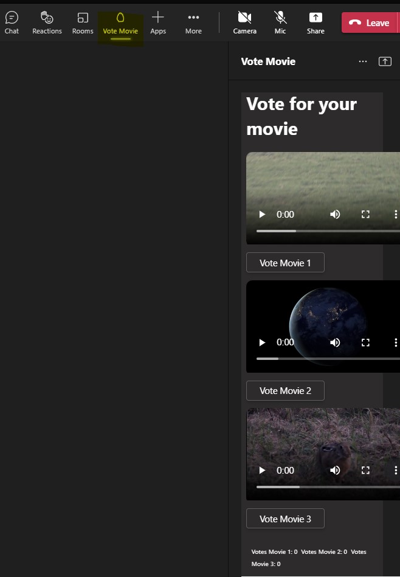

# Tab Meeting StageView Vote Movie Fluid - Microsoft Teams App

Teams meeting app showing up in sidePanel and on stageView. Letting users vote for a movie in sidePanel and shwing then the most voted one for all in stageView. Featured by Microsoft FluidFramework and Azure Fluid Relay service.

## Summary

This sample is a Teams meeting app created using the Teams Yeoman Generator. It's a tab showing up during in-Meeting experience in the sidePanel but also, once shared, in the stageView for all meeting participants. The synchronization of the voting data is established by usage of Microsoft FluidFramework and Azure Fluid Relay service.

Open sidePanel



Share onStage view


The onStage view experience


For further details see the author's [blog post](https://mmsharepoint.wordpress.com/2022/06/25/use-fluidframework-in-a-microsoft-teams-app/)

## Prerequisites

* [Office 365 tenant](https://dev.office.com/sharepoint/docs/spfx/set-up-your-development-environment)
* [Node.js](https://nodejs.org) version 10.14.1 or higher
* [Gulp CLI](https://github.com/gulpjs/gulp-cli) `npm install gulp-cli --global`
* [ngrok](https://ngrok.com) or similar tunneling application is required for local testing
* [Azure Fluid Relay service](https://azure.microsoft.com/en-us/services/fluid-relay?WT.mc_id=M365-MVP-5004617)

    ```bash
    # determine node version
    node --version
    ```

## Version history

Version|Date|Author|Comments
-------|----|----|--------
1.0|Jun 29, 2022|[Markus Moeller](https://twitter.com/moeller2_0)|Initial release

## Disclaimer

**THIS CODE IS PROVIDED *AS IS* WITHOUT WARRANTY OF ANY KIND, EITHER EXPRESS OR IMPLIED, INCLUDING ANY IMPLIED WARRANTIES OF FITNESS FOR A PARTICULAR PURPOSE, MERCHANTABILITY, OR NON-INFRINGEMENT.**

## Minimal Path to Awesome
- Clone the repository
    ```bash
    git clone https://github.com/mmsharepoint/tab-meeting-stageview-vote-movie-fluid.git
    ```

- In a console, navigate to `/tab-meeting-stageview-vote-movie-fluid`

    ```bash
    cd tab-meeting-stageview-vote-movie-fluid
    ```

- Install modules

    ```bash
    npm install
    ```
- Create an Azure App Configuration as [described here](https://mmsharepoint.wordpress.com/2021/05/17/configure-teams-applications-with-azure-app-configuration-nodejs/#createappconfig)
- Add your configured App Configuration Http endpoint to .env as AZURE_CONFIG_CONNECTION_STRING
- Register an app and secret and insert it to your .env as AZURE_TENANT_ID, AZURE_CLIENT_ID, AZURE_CLIENT_SECRET and grant access to the Azure App Configuration and Azure Key Vault if you need to debug locally
- Setup a Azure Fluid Relay Service and put corresponding parameters to .env
- Adjust code to only use InsecureTokenProvider OR
- Deploy and configure parallel Azure Function acting as a token provider: https://github.com/mmsharepoint/fluid-vote-movie-tokenprovider 
- You will need to register an app in Azure AD [also described here](https://mmsharepoint.wordpress.com/2021/09/07/meeting-apps-in-microsoft-teams-1-pre-meeting/#appreg)
  - "Registered App" will be the identity provider app given by the Azure Function
  - With exposed Api "access_as_user" and App ID Uri api://{NGrok-Url}/{<App ID>}
  - With the client IDs for Teams App and Teams Web App 1fec8e78-bce4-4aaf-ab1b-5451cc387264 and 5e3ce6c0-2b1f-4285-8d4b-75ee78787346
- Also add the app ID and other relevant parameters to local .env (taken from .env-sample) as TAB_APP_ID=  e.g.
- Run ngrok and note down the given url

    ```bash
    gulp start-ngrok
    ```
- Package the app
    ```bash
    gulp manifest
- Start the app
    ```bash
    gulp serve --debug
    ```
- Create a new teams meeting with at least one participant
- Open the meeting in Edit mode
- At the right end of the tabs click (+) to add a new app and sideload your package
- Join the meeting with a physical Teams desktop client

## Features

This is a Teams Tab meeting app to show up in side panel and meeting stageView
* Show a tab in in-meeting experience in sidePanel
* Show as in-meeting experience shareable in stageView for all participants at the same time
* Show individual content based on the frameContext (sidePanel vs meetinStage)
* Configure your Teams Tab with custom values
    * Store them in Azure App Configuration
* Usage of Microsoft Fluid Framework for syncing real-time data
* Usage of Azure Fluid Relay service as backend service for Microsoft Fluid Framework
* Render video files with React and HTML5


## Useful links

* [Debugging with Visual Studio Code](https://github.com/pnp/generator-teams/blob/master/docs/docs/vscode.md)
* [Developing with ngrok](https://github.com/pnp/generator-teams/blob/master/docs/docs/ngrok.md)
* [Developing with Github Codespaces](https://github.com/pnp/generator-teams/blob/master/docs/docs/codespaces.md)
* [Microsoft's Fluid Framework](https://fluidframework.com/?WT.mc_id=M365-MVP-5004617)
* [Microsoft Azure Fluid Relay service](https://azure.microsoft.com/en-us/services/fluid-relay?WT.mc_id=M365-MVP-5004617)

## Additional build options

You can use the following flags for the `serve`, `ngrok-serve` and build commands:

* `--no-linting` or `-l` - skips the linting of Typescript during build to improve build times
* `--debug` - builds in debug mode and significantly improves build time with support for hot reloading of client side components
* `--env <filename>.env` - use an alternate set of environment files
* `--publish` - automatically publish the application to the Teams App store

## Deployment

The solution can be deployed to Azure using any deployment method.

* For Azure Devops see [How to deploy a Yo Teams generated project to Azure through Azure DevOps](https://www.wictorwilen.se/blog/deploying-yo-teams-and-node-apps/)
* For Docker containers, see the included `Dockerfile`

## Logging

To enable logging for the solution you need to add `msteams` to the `DEBUG` environment variable. See the [debug package](https://www.npmjs.com/package/debug) for more information. By default this setting is turned on in the `.env` file.

Example for Windows command line:

``` bash
SET DEBUG=msteams
```

If you are using Microsoft Azure to host your Microsoft Teams app, then you can add `DEBUG` as an Application Setting with the value of `msteams`.
